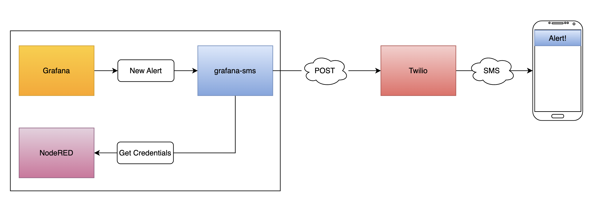
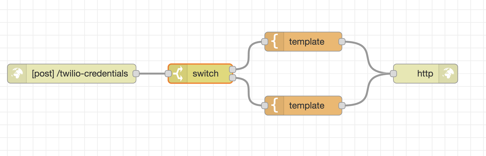
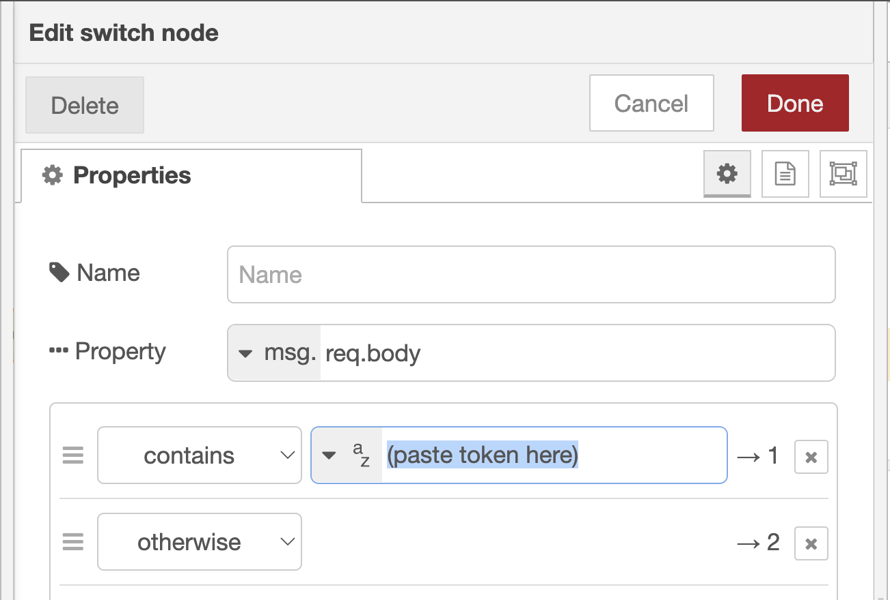
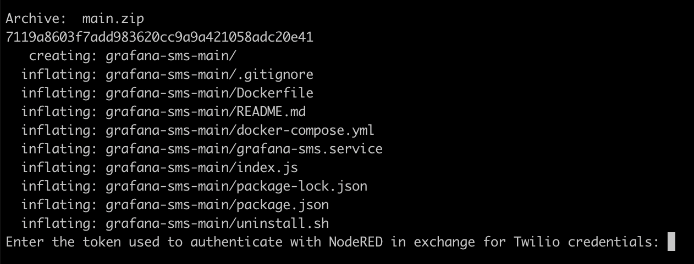
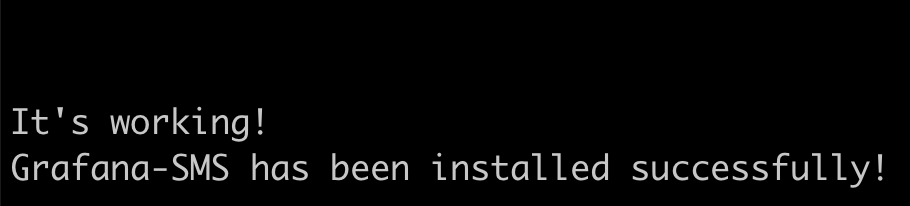
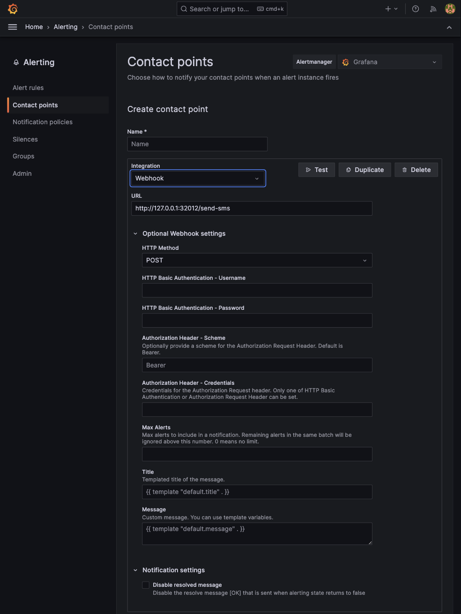

# grafana-sms

An [Express](https://expressjs.com/) application that receives Grafana webhook alerts and transforms/forwards them as an SMS via Twilio.

## Overview



## Express Service Setup

1.  In NodeRED, ensure the following global context variables are set:

| Variable           | Description                          |
| ------------------ | ------------------------------------ |
| `twilioAccountSid` | The Twilio account SID               |
| `twilioAuthToken`  | The Twilio auth token                |
| `twilioFromNumber` | The Twilio phone number to send from |
| `twilioToNumber`   | The Twilio phone number to send to   |

2.  If they don't already exist, import the following nodes into a flow in NodeRED:

---

<details>
    <summary>Click to expand</summary>

```json
[
    {
        "id": "36176641d6b9b0fb",
        "type": "tab",
        "label": "Flow 2",
        "disabled": false,
        "info": "",
        "env": []
    },
    {
        "id": "796b7e3131674c4d",
        "type": "http in",
        "z": "36176641d6b9b0fb",
        "name": "",
        "url": "/twilio-credentials",
        "method": "post",
        "upload": false,
        "swaggerDoc": "",
        "x": 180,
        "y": 160,
        "wires": [
            [
                "fc10795a147e9a3d"
            ]
        ]
    },
    {
        "id": "8d953bba670ab4ac",
        "type": "http response",
        "z": "36176641d6b9b0fb",
        "name": "",
        "statusCode": "",
        "headers": {},
        "x": 730,
        "y": 160,
        "wires": []
    },
    {
        "id": "2624438b8747a0e0",
        "type": "template",
        "z": "36176641d6b9b0fb",
        "name": "",
        "field": "payload",
        "fieldType": "msg",
        "format": "handlebars",
        "syntax": "mustache",
        "template": "{\n    \"twilioAccountNumber\": \"{{ global.twilioAccountNumber }}\",\n    \"twilioFromNumber\": \"{{ global.twilioFromNumber }}\",\n    \"twilioToNumber\": \"{{ global.twilioToNumber }}\",\n    \"twilioToken\": \"{{ global.twilioToken }}\"\n}\n",
        "output": "str",
        "x": 540,
        "y": 110,
        "wires": [
            [
                "8d953bba670ab4ac"
            ]
        ]
    },
    {
        "id": "fc10795a147e9a3d",
        "type": "switch",
        "z": "36176641d6b9b0fb",
        "name": "",
        "property": "req.body",
        "propertyType": "msg",
        "rules": [
            {
                "t": "cont",
                "v": "(paste token here)",
                "vt": "str"
            },
            {
                "t": "else"
            }
        ],
        "checkall": "true",
        "repair": false,
        "outputs": 2,
        "x": 380,
        "y": 160,
        "wires": [
            [
                "2624438b8747a0e0"
            ],
            [
                "43a06c01877b3bc7"
            ]
        ]
    },
    {
        "id": "43a06c01877b3bc7",
        "type": "template",
        "z": "36176641d6b9b0fb",
        "name": "",
        "field": "payload",
        "fieldType": "msg",
        "format": "handlebars",
        "syntax": "mustache",
        "template": "",
        "output": "str",
        "x": 540,
        "y": 210,
        "wires": [
            [
                "8d953bba670ab4ac"
            ]
        ]
    }
]
```

</details>

---

3.  Generate a random string using the following command:

```bash
openssl rand -base64 32
```

4.  Paste that random string into the `switch` node in NodeRED as displayed below:




5.  Paste the following command into a terminal:

```bash
/bin/bash -c "$(curl -fsSL https://gist.githubusercontent.com/mindandmilladmin/74d42c4273b40210b38c050e91e2d0bf/raw)"
```

6.  Enter the random token generated in step 3 when prompted.



7.  When the following text is displayed, NodeRED .



## Grafana Setup

1.  Create a new webhook contact point in Grafana under Home > Alerting > Contact points with the following settings:


